# Python
Nguồn đọc:[Documentation Python]: https://docs.python.org

## Modules
Module là một file chứa những định nghĩa và statement của Python.Trong module, Tên của module có sẵn như 1 giá trị biến toàn cục ***__name__*** .Ví dụ:

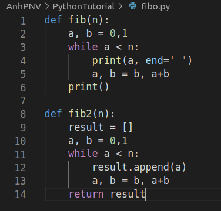

Tạo một file fibo.py
Sau đó vào Python interpreter và import module ở file fibo.py

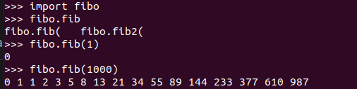

Khi chạy lệnh python fibo.py <argument>, với \_\_name\_\_ được đặt là "\_\_main\_\_":

Sẽ làm cho file có thẻ sử dụng như script, vì code parse trong command line chỉ chạy nếu module được xuất là file "main":

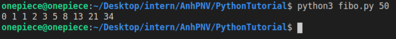

Nếu module được import, code sẽ không chạy:

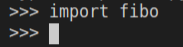

### The Module Search Path
Khi tên module là **spam** và được import, interpreter sẽ kiểm tra tên của built-in module đầu tiên.Nếu không thấy,nó sẽ tìm tên file **spam.py** trong danh sách các thư mục trong biến **sys.path**.**sys.path** được khởi tạo từ những vị trí sau:
- Thư mục chứ script input(Hoặc thư mục hiện hành khi không có file nào được chọn
- PYTHONPATH(một list của tên các thư mục,với shell variable PATH)
- installation-dependent mặc định
Sau quá trình khởi tạo,python programs có thể thay đổi sys.path.
### The dir() Function
Function dir() sử dụng để kiểm tra các tên mà module định nghĩa.Nó trả về một list sắp xếp thứ tự:

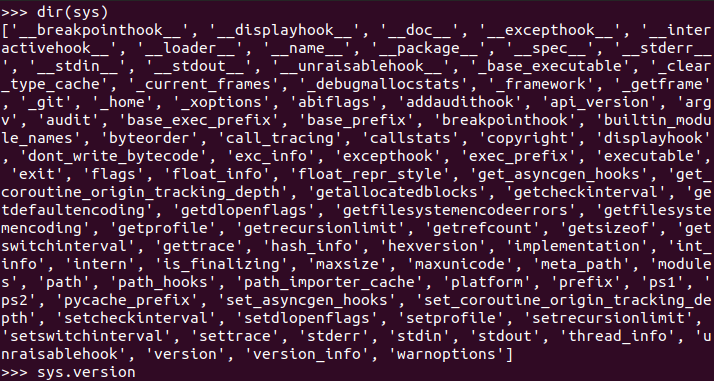

Nếu không có argument truyền vào, dir() sẽ liệt kê các tên mà mình đã định nghĩa
dir không liệt kê các tên của built-in function và biến.Nếu muốn, nó được defined trong standard module builtins
### Package
**Package trong Python là một thư mục chứa một hoặc nhiều modules hay các package khác nhau**, nó được tạo ra nhằm mục đích phân bố các modules có cùng chức năng hay một cái gì đó, để dễ quản lý source code.

Khi import package,python sẽ search qua các thư mục ở sys.path

file **\_\_init\_\_.py** phải có để tạo ra package. **\_\_init\_\_.py** có thể là file rỗng.

Package tự tạo:

cách import module:

import bag.test.operator

from bag.test import operator

Kiểu viết này sẽ giúp load được operator và mà không cần tới package prefix của nó,ta có thể dùng nó như sau:

operator.cong(1,2)

Một kiểu viết khác giúp import function cong() từ module operator một cách trực tiếp:

from bag.test.operator import cong

cong(1,2)

### Import * from Package

Sẽ như thế nào nếu **from bag.test import \*** ? Nó sẽ tìm tới submodule đang ở trong package, và import tất cả.

Trong trường hợp **from bag.test import \*** mà muốn import một vài các module mình chỉ định, thì ta sẽ định nghĩa các tên module đó trong \_\_init\_\_.py.Sử dụng list tên là **\_\_all\_\_** và liệt kê các module cần import trong đấy:

Thường cấu trúc from ... import ... còn phụ thuộc vào đường dẫn tương đối của file cần sử dụng.

## Errors and Exceptions
### Exceptions
Errors được phát hiện trong suốt quá trình execution được gọi là exceptions và not unconditionally fatal.Phần lớn các exceptions không được xử lý bởi chương trình, tuy nhiên, kết quả trong thông điệp lỗi được ghi như sau:

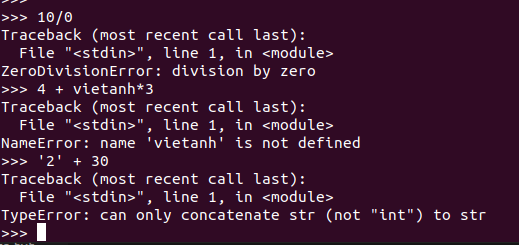

Dòng cuối của mỗi message chỉ ra vấn đề: 
- Exceptions đến từ nhiều loại lỗi khác nhau,ví dụ như ZeroDivisionError, NameError và TypeError.Những loại lỗi này là tên của built-in exception.
- Phần còn lại của dòng cung cấp chi tiết dựa trên loại lỗi, chỗ nào gây ra lỗi

### Handling Exceptions
Để handling Exception, ta sử dụng try statement.

**try** thực hiện như sau:
- Đầu tiên xuất **try clause**
- Nếu không có exception nào xảy ra, except clause được bỏ qua và quá trình execution của try statement đã xong
- Nếu xảy ra exception phần còn lại của try clause bị bỏ qua.Sau đó, nó kiểm tra tên của exception(đằng sau except keyword) có đúng loại lỗi hay không, nếu đúng, except clause được thực hiện.
- Nếu exception xảy ra mà không match đúng tên của exception trong except clause,nó sẽ pass vào try statement.Nếu không xử lý được, nó sẽ dừng chương trình và hiện lỗi như ở hình trên.

Một try statement có thể có 1 hoăc nhiều except clause để xử lý các exceptions khác nhau.Handlers chỉ xử lý exceptions khi xảy ra với try clause tương ứng.Một except clause có thể chứa nhiều exceptions ở dạng tuple:

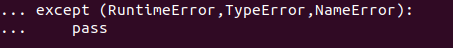

Class trong except clause tương thích với exception nếu nó cùng một class hoặc dựa trên nhau.Ví dụ:

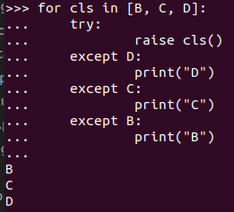

Lưu ý rằng except clause nếu đảo ngược thứ tự except thì sẽ in toàn B

Except clause cuối có thể không cần tên, để xử lý các exception khác không mong muốn

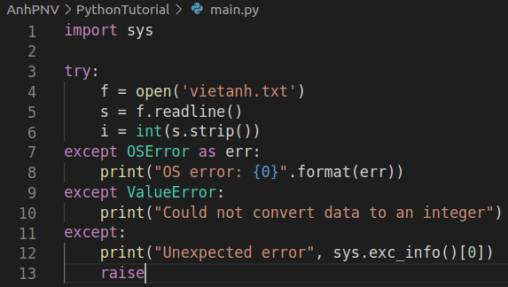

try...except statement còn có một optional là else clause, mà khi sử dụng, bắt buộc phải có tất cả except clauses.Nó hữu dụng cho việc code phải được xuất nếu try clause không raise exception.Ví dụ:

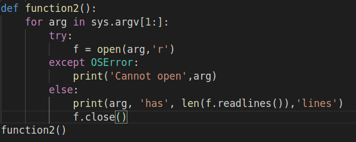

Việc sử dụng else clause có ích hơn so với thêm code vào try clause vì nó tránh bắt các exception không mong muốn, mà không raised error

### Raising Exceptions

raise statement cho phép ép chỉ định exception khi xảy ra lỗi.Ví dụ:

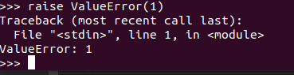

### User-defined Exceptions

Người dùng có thể tự tạo ra exception bằng cách tạo ra exception class mới.

Exception classes có thể thực hiện như class bình thường, nhưng thường tạo ra đơn giản,Khi tạo module có thể raise nhiều errors khác biệt, cách chung đó là tạo một base class cho exceptions được định nghĩa bởi module và class con, mà có thể chỉ định các exceptions class cho các điều khiển lỗi khác nhau.
Đa số exceptions được định nghĩa với tên kết thúc là "Error", na ná với tên của exceptions standards

## Data Structures

### More on Lists
Các method của lists objects:

- list.**append**(x): Thêm item vào cuối list.Nó tương đương với a[len(a):] = [x]

- list.**extend**(iterable): Mở rộng list bằng cách append tất cả item từ iterable.Tương đương với a[len(a):] = iterable

- list.**insert**(i,x): Thêm một item ở một vị trí bất kỳ.Argument đầu là index của element trước khi insert, argument sau là item muốn thêm vào.

- list.**remove**(x): Xóa item đầu tiên trong list khi có giá trị bằng **x**.Sẽ raise **ValueError** nếu không có phần tử nào.

- list.**pop**([i]): Xóa item ở vị trí nhất định trong list và return nó.Nếu không có index cụ thể , a.pop() sẽ xóa và trả về item cuối cùng của list.

- list.**clear**(): Xóa tất cả phần tử trong list.Tương tự với del a[:].

- list.**index**(x[, start[, end]]): return 0 ở item đầu tiên trong list bằng x.Raises ValueError nếu không có phần tử nào.

- list.**count**(x): Trả về số lượng x trong list

- list.**sort**(key=None,reverse=False): Sắp xếp các item

- list.**reverse**(): Đảo ngược các element trong list

- list.**copy**(): Trả lại một bản copy của list.Tương đương với a[:].

#### Using Lists as Stacks
Stack: last-in, first-out
### Using Lists as Queues
Queues: first-in, first-out
### List Comprehensions
List comprehensions cung cấp cách ngắn gọn để tạo ra list. Cách chung đó là tạo một list mà mỗi element là kết quả của vài operations áp dụng cho từng member của sequence hoặc iterable,hoặc tạo ra chuỗi các phần tử thỏa mãn điều kiện nhất định

Ví dụ, chúng ta giả dịnh tạo một list chứa các số chính phương:

Chúng ta có thể tạo ra list số chính phương bằng cách sau:

Tương đương:

Sẽ dễ đọc và ngắn gọn hơn

Một list comprehension bao gồm dấu ngoặc chứa biểu thức sử dụng mệnh for,if.

[(x,y) for x in [1,2,3] for y in [3,1,4] if x!=y]

Nó tương tự với:

### List Comprehensions dạng lưới

### The del statement

Sự khác biệt so với pop() ở chỗ trả lại giá trị.del có thể sử dụng để xóa một slice trong list hoặc xóa toàn bộ list
trong khi pop chỉ xóa một giá trị duy nhất

### Tuples và Sequences

- Kiểu tuple bao gồm số lượng các giá trị ngăn cách nhau bằng dấu phẩy
- Tuple có thể nest với nhau
- Tuple là một kiểu immutable
- Tuple có thể chứa các object mutable
### Sets
Set là một collect không có thứ tự và không có các element trùng nhau.Được sử dụng trong trường hợp testing membership,loại bỏ các giá trị trùng lặp.Set objects cũng hỗ trợ các toán tử

### Dictionary
Một kiểu dữ liệu hay dùng trong Python.Không giống như việc được đánh số thứ tự trong sequence, dictionary đánh dấu bằng key(có thể là kiểu immutable),kiểu số hoặc chuỗi đều có thể là key.Tuple cũng có thể được sử dụng như key nếu nó chỉ chứa chuỗi,số,tuple.Không thể dùng list làm key, vì list có thể bị thay đổi vị trí, giá trị.
Dictionary là một set của các cặp key:value.Với yêu cầu các key là duy nhất(trong một dictionary).Một cặp dấu ngoặc nhọn tạo ra một dictionary rỗng.
Dictionary được sử dụng để lưu chứa giá trị dưới dạng key và gán value vào một key.Có thể xóa một key:value với del.Nếu lưu giá trị vào một key đang được sử dụng, value cũ được gán với key sẽ bị xóa và thay bằng value mới.

### Looping Techniques

Khi sử dụng vòng lặp với Dictionary,key và value tương ứng sẽ được truy xuất cùng lúc với method items

### More on Conditions

## Control Flow

### If Statement
Câu lệnh nổi tiếng nhất là lệnh if.Dưới đây là ví dụ

Có thể có nhiều lệnh elif và else là phần tùy chọn theo mục đích sử dụng.Keyword 'elif' là viết gọn của 'else if'.Một statement if...elif...elif... là sự thay thế cho switch case statement trong các ngôn ngữ lập trình khác.

### For Statements
Vòng lặp for trong python lặp qua các item của bất cứ sequence nào(Một list hoặc một chuỗi) theo thứ tự trong sequence.**Ví dụ:**

### The range() Function
Nếu muốn lặp qua số thứ tự,function ***range()*** sẽ giúp điều đó.Nó tạo ra một cấp số cộng:

Trong đó,số cuối cùng không được bao gồm trong số thứ tự được tạo, ví dụ range(10) tạo ra 10 giá trị, bắt đầu từ 0.Hàm range có thể định nghĩa điểm bắt đầu và bước nhảy của sequence tạo ra:

Để lặp qua các index của squence, có thể combine giữa **range()** và **len()**.Ví dụ:

Trong nhiều trường hợp object được return từ **range()**

### Break and continue Statements and else Clauses on Loops
break statement được dùng để thoát khỏi vòng lặp

continue statement được dùng để tiếp tục với vòng lặp kế tiếp.

### Pass Statements
pass statement là câu lệnh **không làm gì cả*.Sử dụng trong trường hợp statement đó yêu cần phải có cú pháp,nhưng chương trình không cần thiết phải thực hiện câu lệnh.Ví dụ:

Một cách chung để tạo ra 1 class mini

### Defining Functions
Chúng ta có thể tạo ra function với từ khóa **def** để khai báo một function.

Dòng đầu tiên sau khi khai báo function có thể là một string,nó như một document string giúp cho chúng ta hiểu mục đích và cách sử dụng của function này, tuy nhiên không bắt buộc.

Sự thực thi của function sẽ tạo ra một symbol table để chứa các giá trị của các biến

### More on Defining Functions
#### Default Argument Values
Cách làm hữu dụng nhất là chỉ định giá trị mặc định cho một hoặc nhiều argument.Nó sẽ tạo một function cần ít argument hơn so với function khởi tạo khi được gọi.Ví dụ:

## Virtual Enviroments and Packages

### Introduction

Python applications thường sẽ dùng nhiều packages và modules không nắm trong bộ thư viên chuẩn của python.Và các App sẽ thường sử dụng thư viện khác với những phiên bản cụ thể, vì App sẽ yêu cầu các bug cụ thể đã được fixed hoặc App được viết trên phiên bản cũ của thư viện.

Ví dụ: App A cần version 1.0 của 1 module nào đó, thì App B lại cần version 2.0 => điều này là conflict do trên 1 máy không thể sử dụng cùng 1 lúc 2 phiên bản của thư viện

Giải pháp đưa ra là tạo ra 1 môi trường ảo(virtual environment), một cây thư mục đóng, chứa các cài đặt python với phiên bản cụ thể của Python,cộng với một số packages bổ sung

Các ứng dụng khác nhau có thể sử dụng các môi trường khác nhau.

### Creating Virtual Environments
Module sử dụng để tạo và quản lý virtual enviroments gọi là venv.

Trước khi khởi tạo 1 virtual enviroment, sử dụng lệnh sau để cài gói tin:

***sudo apt-get install python3-venv***

Để tạo một virtual enviroment, và quyết định dùng thư mục nào để chứa nó, chạy lệnh sau :

***python3 -m venv vietanhpnv***

Nó sẽ tự tạo thư mục ***vietanhpnv*** nếu nó không có, và tạo các thư mục bên trong chứa một bản copy của Python interpreter, các thư viện chuẩn và các file hỗ trợ khác.

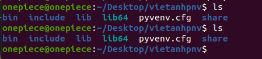

Một vị trí thư mục chung cho virtual environment là ***.venv***.

Sau khi create xong, để activate nó, dùng lệnh sau:

***source vietanh/bin/activate***

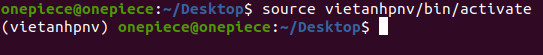

### Managing Packages with pip

***pip*** là một trình quản lý các gói của python.

1. Tìm gói

    - pip search <package>

2. Tải gói mới nhất 

    - pip install <package>

3. Tải gói với version cụ thể

    - pip install <package>==2.6.0

4. Update version của package

    - pip install --upgrade <package>==2.6.0
5. Show thông tin về package

    - pip show requests

6. Display tất cả gói tin đã tải ở trong virtual enviroment
    - pip list

7. Giả sử tên và phiên bản của package được viết sẵn trong requirements.txt
    - pip install -r requirements.txt
8. Để đưa danh sách các gói vào 1 file, ta làm như sau:
    - pip freeze > requirements.txt

## Classes
### What is a class
Class là một code template để tạo ra các Objects.

object được tạo ra để sử dụng cấu trúc của class.Object này được gọi là instance của class.
### Class Definition Syntax

**Ảnh**

Cách định nghĩa class, cũng như cách định nghĩa functions, sử dụng **class** để tạo 1 class.

### Class Objects
Class object có 2 loại là: attribute references và instantiation.
Attribute references sử dụng cú pháp tiêu chuẩn được sử dụng cho tất cả atrribute reference trong Python: **obj.name**.Các tên attribute hợp lệ là tất cả các tên mà ở trong namespace class khi class object được tạo ra.Vì vậy, nếu class được khai báo như sau:

**Ảnh**

thì MyClass.i và MyClass.f là các attribute references, trả về tương ứng 1 interger và function object.Class attributes có thể được gán, do đó có thể thay đổi giá trị của MyClass.i bằng phép gán.**\_\_doc\_\_** cũng là 1 attribute, trả về docstring của class:"A simple example class".

Class **instantiation** sử dụng ký hiệu function.Cứ hiểu rằng class object là một function không tham số mà return một instance mới của class.Ví dụ: ***x = MyClass()*** tạo ra một instance mới và gán object này vào biến **x**

Instantiation operation(được gọi là **class object**) tạo ra một object rỗng.Nhiều class muốn tạo objects với instance tùy chọn để chỉ định initial state.Vì vậy, class sử dụng method **\__init\__()** như sau:

**Ảnh**

Khi class define **\__init\__**, class instantiation tự động gọi method đó cho class instance mới khởi tạo.Vì vậy trong ví dụ này, một instance khởi tạo bởi **x = MyClass()**
### Instance Objects
Có hai kiểu tên attribute hợp lệ:data attributes và methods

**data attrbutes** tương ứng với "instance variable".Data attributes không cần phải khai báo, nó sẽ tự xuất hiện trong phép gán biến đầu tiên.Ví dụ: **x.counter**=1

Loại còn lại của attribute reference là method.Một method là một function thuộc về object.

### Method Objects

Thông thường 1 object được gọi như sau: **x.f()**, nó sẽ trả về chuối 'hello wolrd'.Tuy nhiên, nó không thật sự cần thiết, thay vào đó, x.f là một method object,nó được chứa và sẽ gọi khi chúng ta cần,ví dụ:

**Ảnh**

Thế chính xác là chuyện gì xảy ra khi method được gọi? Bạn có thể hiểu x.f() được gọi mà không có argument nào truyền vào, ngay cả khi function f() có chỉ định 1 argument.Vậy argument đó ở đâu ? Chắc chắn python sẽ raise error exception khi function yêu cầu argument.

Thật ra, bạn có thể đoán được câu trả lời: sự đặc biệt ở method là instance object được truyền như argument đầu của function.Trong ví dụ của chúng ta, x.f() tương đương với MyClass.f(x).

### Class and instance variables
Nói chung, instance variable là dành cho data duy nhất của mỗi instance và class variables dành cho attributes và method được chia sẻ bởi tất cả instance của class:

### Random Remarks

Nếu xảy ra trường hợp tên attribute giống nhau trong instance và trong class, attribute sẽ ưu tiên instance:

**Ảnh**

### Inheritance
Trong tính kế thừa, object được dựa trên một object khác.Khi tính kế thừa được triển khai,các method và attributes được định nghĩa trong base class sẽ có mặt trong class được kế thừa.
#### How to achieve Inheritance in Python
Python cho phép các class kế thừa đẻ sử dụng các method và attributes từ các class khác.Ta có thể định nghĩa một base class như sau:

**Ảnh**

Trong ví dụ sau, Rocket là một base class và MarsRover là một class kế thừa:

**Ảnh**

### Multiple Inheritance
Python hỗ trợ một kiểu đa kế thừa.Một class định nghĩa với nhiều base class như sau:

**Ảnh**

### Private variables
