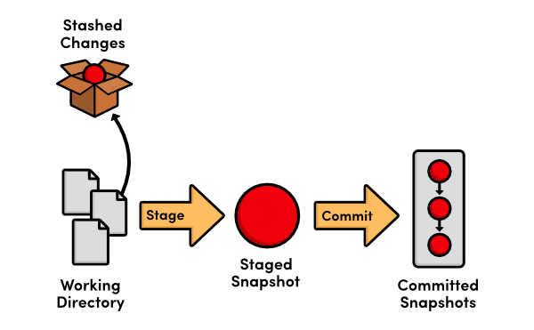
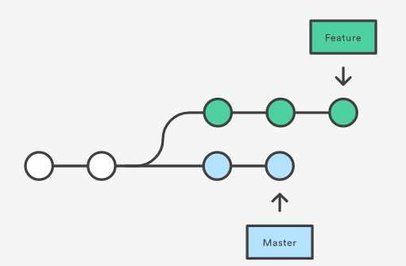
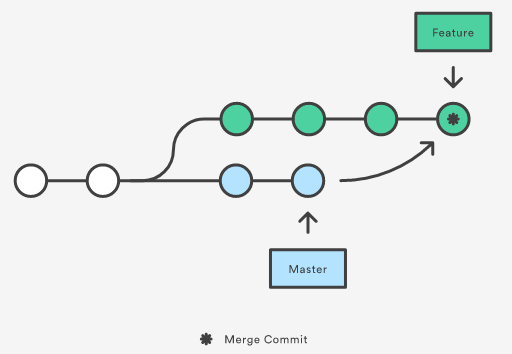
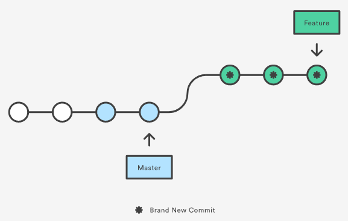

**GIT TUTORIAL**
=================
1. Git là gì
* Git là hệ thống quản lý phiên bản phân tán(distributed version control system)
Nhờ git mà việc quản lý code và làm việc nhóm của developer trở nên dễ dàng.
2. Git làm được gì
* Git đặc biệt hơn các hệ thống quản lý phiên bản ở chỗ có thể chia ra làm nhiều nhánh(Branch) khác nhau, thuận tiện cho việc sửa code, kiểm tra lịch sử code và nhất là giúp cho **update phiên bản mới rất nhanh**.
3. Git & Github & Gitlab giống/khác gì nhau?
* Cả 3 đều là nền tảng về quản lý phiên bản phân tán

## Về Github
* Github cung cấp git server miễn phí, ngoài ra, nó là một trang web, một cộng đồng dành cho developer, giúp cho việc giao lưu, học hỏi và chia sẻ code cho nhau => tính cộng đồng của github cao
* Github có cung cấp các dịch vụ trả phí dành cho doanh nghiệp
* Ngoài ra github còn cung cấp dịch vụ deploy web trên cloud
Về Gitlab
* Gitlab cung cấp dịch vụ git server, và theo hướng bảo mật cho doanh nghiệp.
* Trái với github, tính cộng đồng của gitlab được đánh giá không cao,
* Hỗ  trợ cơ chế CI/CD tự động tốt hơn github

## Các trạng thái có thể có trong git repository

1. Tracked
    Là tập tin đã được đánh dấu theo dõi trong Git để làm việc.
    Khi được đưa về Tracked, nó có thể thay đổi giữa ba trạng thái khác nhau:Modified,Unmodified,Stage.
2. Untracked
    Là tập tin còn lại mà không muốn làm việc với nó trong Git.
3. Modified 
    Là trạng thái đã chỉnh sửa sau lần commit cuối cùng
4. Umodified
    Là trạng thái tập tin sau khi commit lần cuối
5. Staged
    Trạng thái tập tin khi chuẩn bị commit

## Git commit là gì

Để ghi lại việc thêm/thay đổi file hay thư mục vào repository thì sẽ thực hiện thao tác commit.

Khi thực hiện commit, trong repository sẽ tạo ra commit(hoặc revision), ghi lại sự khác biệt từ trạng thái đã commit lần trước tới hiện tại.

Thao tác commit yêu cầu nhập giải thích commit, vì phần giải thích đó sẽ trở thành thông tin quan trọng khi bản thân xem lại lịch sử.

## Làm việc với banch

Tạo mới branch: git checkout -b AnhPNV/git branch **AnhPNV**.

Nhảy từ branch này sang branch khác: git checkout AnhPNV.

Rename branch: Switch to branch which you want to rename, and than git branch -m ****.

Git merge: git merge <branch you want to merge>

## Stash

Giả sử một ngày đẹp trời đang code, anh Vĩnh gọi Việt Anh debug lại cái phần code trước đó, thế là Việt Anh đang từ các đầu công việc đang code dở, phải debug lại phần code cũ. Vậy phải làm gì để lưu lại các công việc đang làm dở đây?Chẳng lẽ phải git reset --hard? Việt Anh nghĩ.Sau một hồi google, Việt Anh bắt đầu biết khái niệm về **git stash**

Git stash sẽ cung cấp một branch và ghi lại các thay đổi.

Môt số câu lệnh từ git stash

### Git stash save

Git stash save + "message kèm theo"
*   Có tác dụng lưu các thay đổi kèm theo một message 

### Git stash list
*   Liệt kê các stash mà mình đã lưu lại
*   Thực chất khi dùng git stash save, thì Git sẽ tạo ra một commit. Git stash list dùng để xem các commit đó

### Git stash apply
*   Apply **stash gần nhất**
*   Apply stash dựa theo id : git stash apply + **sha@{0}**

### Git stash branch branch-draft
*   Tạo một commit stash trên một nhánh khác 

### Git stash drop
*   Xóa stash gần nhất
*   Xóa một stash bất kỳ: git stash drop + **sha@{0}**

### Git stash clear
*   Kill them all!

## Merge và Rebase.

<!-- Format:  -->
Giả sử trên nhánh master và nhánh feature đều có lượng commit tương ứng
Merge và Rebase, đều là cách để gộp những thay đổi từ nhánh này sang nhánh kia.

Merge là cách gộp nhánh mà, sau khi thực hiện xong,git sẽ tạo bản commit trên nhánh đấy, mà lịch sử commit trước không thay đổi.

Git Rebase là một chức năng được dùng khi gắn nhánh đã hoàn thành công việc vào nhánh gốc . Về mặt nội dung thì là việc điều chỉnh nhánh công việc gắn vào với nhánh gốc nên các commit sẽ được đăng kí theo thứ tự gắn vào . Lợi ích chính của việc rebase là tạo ra một lịch sử commit rõ ràng, dễ theo dõi hơn merge.

Interactive Rebase

Git Rebase khi remote có cập nhật mới

git pull --rebase

### 1 số câu lệnh tự tìm hiểu

Download trên một nhánh

 git clone --single-branch --branch VietAnhPN https://github.com/vtnet-cloud-native-ci-cd-trainees/intern

### Git remote
git remote -v

git remote add <name> <url>

git remote rename origin vietanh

git clone

Lệnh này sẽ sao chép toàn bộ dữ liệu trên repository và sao chép luôn các thiết lập về repository, tức là nó sẽ tự động tạo một master branch trên máy tính của bạn. Lệnh này chỉ nên sử dụng khi bạn cần tạo mới một Git mới trên máy tính với toàn bộ dữ liệu và thiết lập của một remote repository.

git pull

Lệnh này sẽ tự động lấy toàn bộ dữ liệu từ remote repository và gộp vào cái branch hiện tại bạn đang làm việc.

git fetch

Lệnh này sẽ lấy toàn bộ dữ liệu từ remote repository nhưng sẽ cho phép bạn gộp thủ công vào một branch nào đó trên thư mục Git ở máy tính.

### Git prune
git remote prune origin tỉa một remote 
### Cherry-pick

git checkout B

git cherry-pick A

cherry-pick sẽ lấy commit cuối cùng ở branch A merge vào branch B
### --force
--force dùng để ép buộc thực hiện lệnh mà có thể gây hại đên repo, xóa bỏ toàn bộ commit 

--force-with-lease vẫn là ép buộc push code lên đó, tuy nhiên không làm mất code trước đó 
### Git reset

reset --hard Lệnh này sẽ xoá toàn bộ các commit trước đó và đưa branch về trạng thái của commit có commit_id đã chọn và cả file sẽ thay đổi theo commit_id đó.

reset --soft Lệnh này sẽ xóa toàn bộ commit trước đó, tuy nhiên lệnh này chỉ xóa commit , các thay đổi mới của các file sẽ vẫn giữ nguyên và cho vào mục staging => có lợi khi muốn gộp commit vào với nhau, vì trong nhiều trường hợp thay đổi file không nhiều mà commit, dẫn đến tình trạng commit bừa

