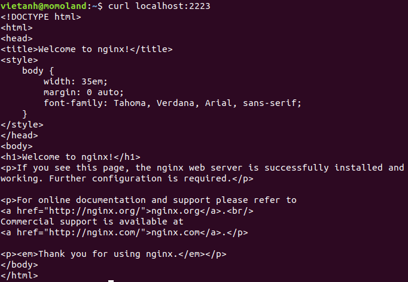

# Docker

## Proxy Configuration
sudo mkdir -p /etc/systemd/system/docker.service.d
sudo vi /etc/systemd/system/docker.service.d/proxy.conf

[Service]
Environment="HTTP_PROXY=http://myproxy.hostname:8080"

Environment="HTTPS_PROXY=https://myproxy.hostname:8080/"

Environment="NO_PROXY="localhost,127.0.0.1,::1"

sudo systemctl restart docker.service

### Docker pull

Để tải một image cụ thể nào đó, ta dùng lệnh docker pull

Ví dụ: docker pull mysql:5.7

* Tải image mysql với version 5.7 về

#### Pull repo với nhiều images

Mặc định, docker pull sẽ kéo một image đơn từ registry. Một repo có thể chứ nhiều images.Để kéo tất cả images từ một repo, dùng **-a** hoặc **--all-tag**

Nó giống với lại git clone

### Docker Run

Để run một image, ta dùng lệnh docker run

Tuỳ vào cách dùng mà có nhiều tùy chọn khác nhau 

### DockerFile

Dockerfile là file config cho Docker để build ra image.Nó dùng một image cơ bản để xây dựng lớp image ban đầu.Một số image cơ bản: python,ubuntu,alpine.Sau đó nếu có các lớp bổ sung thì nó được xếp chồng lên lớp cơ bản. Cuối cùng một lớp mỏng có thể được xếp chồng lên nhau trên các lớp khác trước đó.
- Các config :
* FROM — chỉ định image gốc: python, unbutu, alpine…
* LABEL — cung cấp metadata cho image. Có thể sử dụng để add thông tin maintainer. Để xem các label của images, dùng lệnh docker inspect.
* ENV — thiết lập một biến môi trường.
* RUN — Có thể tạo một lệnh khi build image. Được sử dụng để cài đặt các package vào container.
* COPY — Sao chép các file và thư mục vào container.
* ADD — Sao chép các file và thư mục vào container.
* CMD — Cung cấp một lệnh và đối số cho container thực thi. Các tham số có thể được ghi đè và chỉ có một CMD.
* WORKDIR — Thiết lập thư mục đang làm việc cho các chỉ thị khác như: RUN, CMD, ENTRYPOINT, COPY, ADD,…
* ARG — Định nghĩa giá trị biến được dùng trong lúc build image.
* ENTRYPOINT — cung cấp lệnh và đối số cho một container thực thi.
* EXPOSE — khai báo port lắng nghe của image.
* VOLUME — tạo một điểm gắn thư mục để truy cập và lưu trữ data.

## Docker CE/Docker EE
Docker EE có ba versions: cơ bản,tiêu chuẩn và nâng cao.
Phiên bản Basic là: Docker Platform, support,certification, Trong khi đó 2 phiên bản kia có một số tính năng như quản lý container và docker Security Scanning
Docker CE có hai versions: Edge và Stable
Edge sẽ phát hành mỗi tháng với các tính năng mới nhất
Stable sẽ phát hành theo quý và thường ổn định hơn so với Edge
## Docker Engine
Docker engine là một ứng dụng client-server với những thành phần chính sau:

- Một kiểu server
- Là một REST API mà chương trình có thể sử dụng nó để giao với daemon
- Là một CLI client
CLI sử dụng Docker REST API để giao tiếp với Docker Daemon thông qua các dòng lệnh

***Daemon*** dùng để tạo và quản lý các object của Docker như images,containers,networks,volumes

## Docker Compose

Compose là tool để định nghĩa và chạy ứng dụng docker đa container.Với compose, sử dụng file YAML để cấu hình dịch vụ ứng dụng.Với một lệnh đơn,ta có thể tạo và chạy tất cả dịch vụ từ file cấu hình đó.

Sử dụng Compose về cơ bản có 3 tiến trình:

1. Define môi trường app với Dockerfile để nó thể tái sử dụng bất cứ đâu 
2. Define các dịch vụ tạo nên app với docker-compose.yml, để nó chạy với nhau trên môi trường bị cô lập
3. Dùng lệnh docker-compose run để build

Compose có các lệnh để quản lý toàn bộ lifecycle(vòng đời) của app:

- start, stop và rebuild services
- Kiểm tra trạng thái của services đang chạy
- Chạy lệnh trên một dịch vụ

**Syntax docker-compose.yml**
## Docker Registry
là nơi lưu trữ riêng của Docker Images. Images được push vào registry và client sẽ pull images từ registry. Có thể sử dụng registry của riêng bạn hoặc registry của nhà cung cấp như : AWS, Google Cloud, Microsoft Azure.
## Docker Daemon
Nó là một docker server, quản lý toàn bộ các object của docker như network,data-volume,images và container
## Docker network: Host, Bridge, Overlay, ...
**1. Network Host**

Containers sẽ dùng mạng trực tiếp của máy host. Network configuration bên trong container đồng nhất với host

docker run -dit --name alpine9 --network host alpine ash

docker attach alpine9

ifconfig

**2. Network Bridge**

Docker sẽ tạo ra một switch ảo. Khi container được tạo ra, interface của container sẽ gắn vào switch ảo này và kết nối với interface của host.

Thường khi không cấu hình network cho một container, nó sẽ tự động kết nối mạng bridge mặc định trong máy

***User-defined network***

Ngoài việc sử dụng các network mặc định do docker cung cấp. Ta có thể tự định nghĩa ra các dải network phù hợp với công việc của mình.

docker network create --driver bridge --subnet 192.168.1.0/24 upin

Không giống với mạng host, bridge chỉ cung cấp card mạng cần thiết để kết nối tới các container khác

Docker sẽ tạo ra một switch ảo. Khi container được tạo ra, interface của container sẽ gắn vào switch ảo này và kết nối với interface của host.

Thường khi không cấu hình network cho một container, nó sẽ tự động kết nối mạng bridge mặc định trong máy

User-defined network

Ngoài việc sử dụng các network mặc định do docker cung cấp. Ta có thể tự định nghĩa ra các dải network phù hợp với công việc của mình.

docker network create --driver bridge --subnet 192.168.1.0/24 upin

Không giống với mạng host, bridge chỉ cung cấp card mạng cần thiết để kết nối tới các container khác
### Khác biệt giữa user-defined bridge và default bridge

1. user-defined bridge cung cấp giải pháp DNS tự động giữa các container
2. user-defined bridge cung cấp sự độc lập tốt hơn.
3. container có thể attached và dettached từ mạng user-defined
4. Mỗi mạng user-defined sẽ được setup theo ý của người sử dụng
5. Liên kết containers trên mạng default-bridge chia sẻ 

## Docker volume, mount

Volume là một cơ chế ưa sử dụng cho việc bảo toàn dữ liệu được phát ra và được sử dụng trên Docker containers.Trong khi bind mounts dựa trên cấu trúc thư mục của host machine thì volume quản lý hoàn toàn bằng Docker.Volume có một số lợi ích so với bind mount như sau:

- Volume dễ dàng back up và migrate hơn bind mounts
- Có thể quản lý volume bằng lệnh CLI hoặc Docker API
- Hoạt động trên cả linux windows container
- Volume có thể share dữ liệu an toàn hơn trên nhiều container
- Volume driver sẽ cho bạn chứa các volume trên remote host,cloud provider,để mã hóa contents của volumes,hoặc thêm chức năng 
- Volume mới có thể có dữ liệu trước đó của container
Ngoài ra volumes thường là lựa chọn tốt cho việc bảo toàn dữ liệu trên lớp writeable container 

Để tiến hành chia sẻ file html tĩnh cho các 2 web server nginx, đầu tiên mình tạo một volume và đặt tên nó là nginx-volume

docker volume create nginx-volume

Mỗi volume được lưu trữ trong host file system(/var/lib/docker/volumes) và được docker quản lý

Để xem thông tin chi tiết về volume đã tạo , dùng câu lệnh

docker volume inspect nginx-volume

Như các bạn thấy thì volume chúng ta nằm ở “/var/lib/docker/volumes/nginx-static-html-share-volume/_data”

Trước khi chui vào đây thì mình sẽ tạo ra hai web server nginx share folder “/usr/share/html” cho cả hai bằng cách mount volume đó vào 2 container.

docker run -d --name nginx1 --mount source=nginx-volume,destination=/usr/share/nginx/html -p 2222:80 nginx

docker run -d --name nginx2 --mount source=nginx-volume,destination=/usr/share/nginx/html -p 2223:80 nginx

Khi bạn chạy docker run một container, có chỉ định — mount, đầu tiên docker sẽ xem volume đã tồn tại hay chưa, nếu chưa thì docker sẽ tạo volume đó. Sau đó docker sẽ tiến hành copy tất cả các file trong destination vào volume và sau khi copy xong docker container sẽ sử dụng volume đó thay cho destination. Mọi thao tác của container với destination thực chất là thao tác với docker volume

Để biết 2 container đã sử dụng chung folder /usr/share/html hay chưa,ta sử dụng lệnh curl

Như vậy thấy được 2 container đã sử dụng chung folder, tuy nhiên để chắc chắn hơn, ta thay đổi file share ở trong thư mục /var/lib/docker/volumes/nginx-volume để kiểm thử

File trước khi thay đổi 

File sau khi thay đổi

Curl lại để thấy kết quả khi thay đổi

**Bind mount**

Bind mount cũng hỗ trợ chia sẻ tài nguyên như volume, tuy nhiên bind mount chỉ có một số chức năng nhất định khi so sánh với docker volume.Khi sử dụng bind mount,file hoặc thư mục trên máy host sẽ mount vào container.Với đường dẫn tương đối hay tuyệt đối.Ngược lại, với volume thì nó sẽ tạo 1 thư mục mới trong nơi lưu trữ docker trên máy chủ, và docker có thể quản lý toàn bộ nội dung của thư mục.

**Tmpfs mount**

Chỉ có linux mới có tùy chọn này.Khi tạo container với tmpfs,container có thể tạo ra các file bên ngoài lớp container's writeable.Tmpfs mount chỉ tồn tại trong bộ nhớ của máy chủ.Nếu container dừng lại, tmpfs mount sẽ bị xóa

## Docker image and Docker container
**IMAGE**
images là một template read-only với mục đích tạo ra docker container.Thông thường, một image dựa trên một image khác,với nhiều tùy chọn khác nhau.

Để build image,ta có thể tạo ra một Dockerfile và định nghĩa các bước thiết lập để tạo ra image.
**CONTAINER**
Một container là một instance của image.Có thể create, start, stop,move,delete một container sử dụng Docker API hoặc CLI.Ta có thể kết nối các container cho một hoặc nhiều mạng, lưu trữ nó, và nó có thể sử dụng để tạo ra một image mới dựa trên trạng thái hiện tại của nó.

